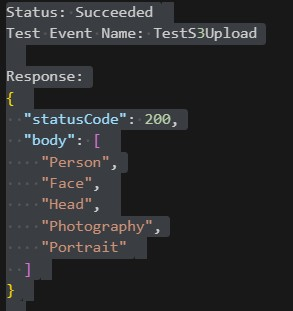
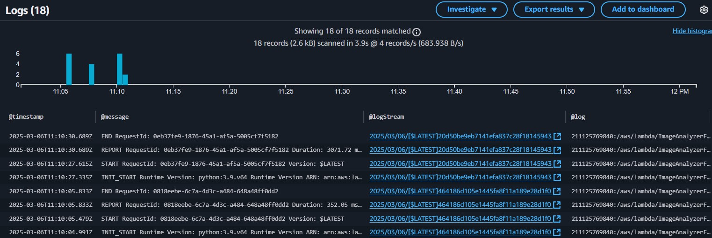

# AWS Image Recognition System

## Overview
This project is an AI-based image recognition system built using **AWS Rekognition**. It uses AWS Lambda to process images uploaded to an S3 bucket and returns labels detected by Rekognition.

## Features
- **Image Upload**: Images are uploaded to an S3 bucket.
- **Label Detection**: AWS Rekognition detects labels in the images.
- **Serverless Architecture**: Built using AWS Lambda, S3, and Rekognition.

## Technologies Used
- **AWS Rekognition**: For image analysis.
- **AWS Lambda**: For serverless processing.
- **Amazon S3**: For storing images.
- **Python (Boto3)**: For interacting with AWS services.

## How It Works
1. An image is uploaded to an S3 bucket.
2. An S3 event triggers the Lambda function.
3. The Lambda function uses AWS Rekognition to detect labels in the image.
4. The results are returned and logged in CloudWatch.

## Setup Instructions
1. Clone this repository.
2. Deploy the Lambda function using the provided CloudFormation template.
3. Upload an image to the S3 bucket and check the results in CloudWatch.

## Screenshots
- **AWS Rekognition Results**:
  
- **CloudWatch Logs**:
  

## License
This project is licensed under the MIT License. See the [LICENSE](LICENSE) file for details.